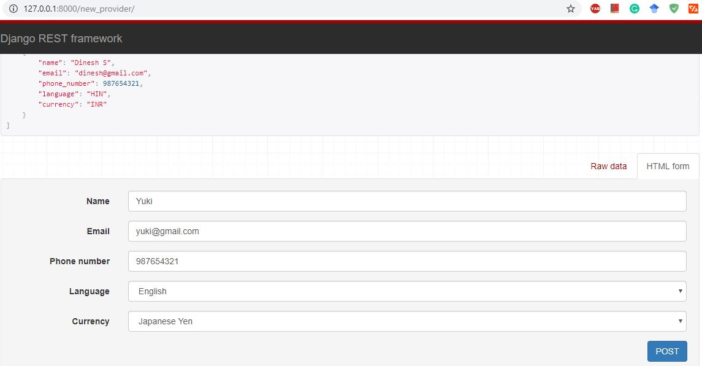
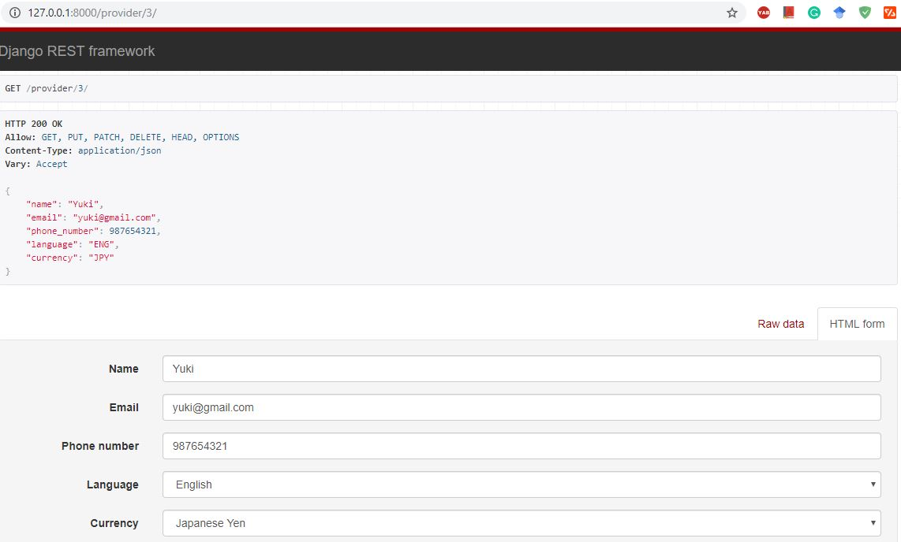
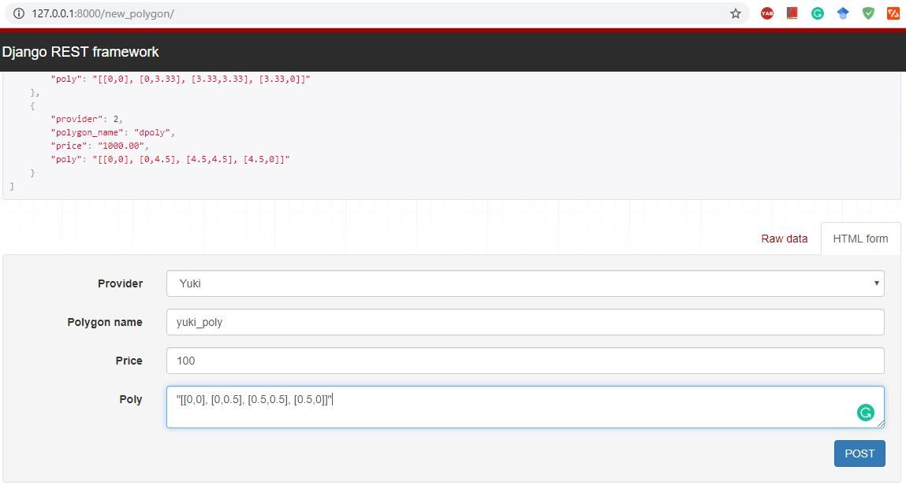
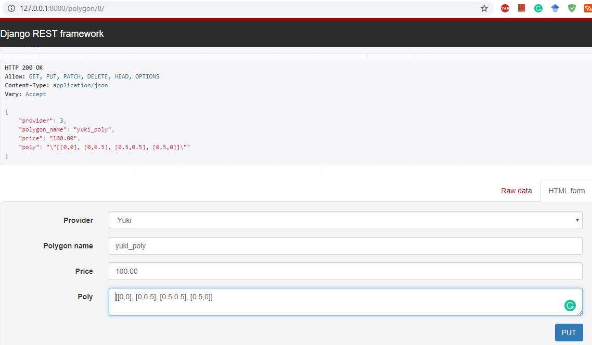
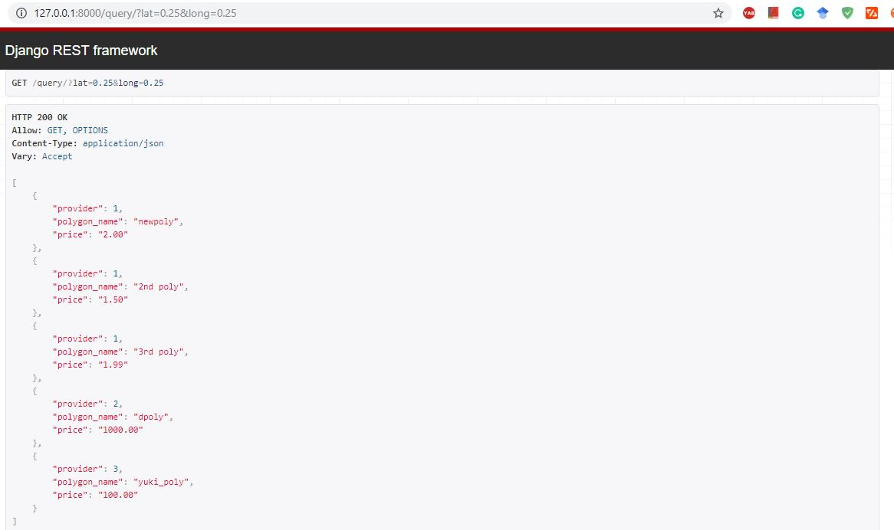

# Mozio-Django-RESTAPI

## For creation of the Provider

Go to new_provider/ link
body of the POST request will contain the following fields
Name, Email, Phone Number, Language, Currency

## For Updating, Retrieving and Deleting the Provider

Go to provider/<int:pk>/ link
Provide the pk (primary key of the Provider)
Update the values in body of the POST request

## For creation of a Polygon for Provider

Go to the new_polygon/ link
Body of the POST request contains the following fields
fields: provider, polygon_name, price and poly (For containing the dimensions)

## For Updation, Retrieving and Deleting a Polygon

Go to the polygon/<int:pk>/ link
Body of the POST request contains the following fields for updating
fields: provider, polygon_name, price and poly (For containing the dimensions)

## For querying on the Polygons

Go to  the link query/?lat=0.25&long=0.25

The query parameters contains the latitude (lat) and longitude (long)
Outputs a list of Polygons, Provider which cater that point

